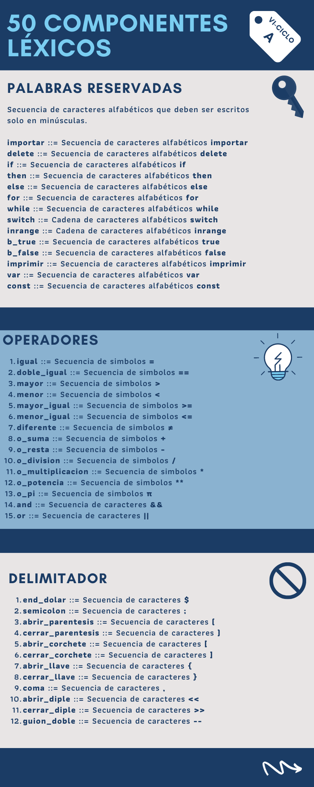
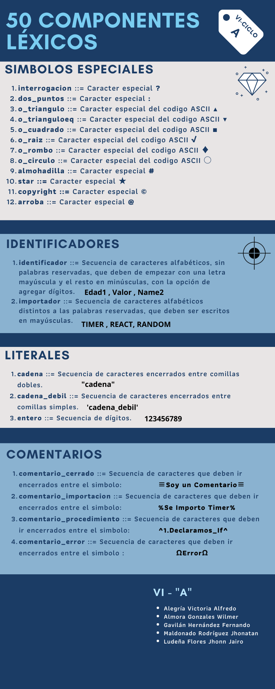

# Analizador Léxico en JavaScript!

Hola a todos, en esta oportunidad estamos presentando un proyecto del Curso de Compiladores en donde se pidió implementar un **Analizador Léxico**. Si quieren darle un vistazo rápido a nuestro proyecto, pueden ir al siguiente link:

> **Proyecto Final Demostración:** [AnalizadorLexicoHerokuapp](https://analizador-lexicojs.herokuapp.com/)

El **Código de este Proyecto** es **Libre** para toda persona, grupo, organización que desea tener una idea de como funciona un Analizador Léxico.

# Componentes Léxicos:

Le recomendamos empezar por conocer un poco de nuestro lenguaje de programación propuesto:

<object data="./Pages/componentes.pdf" type="application/pdf" width="100%"></object>
